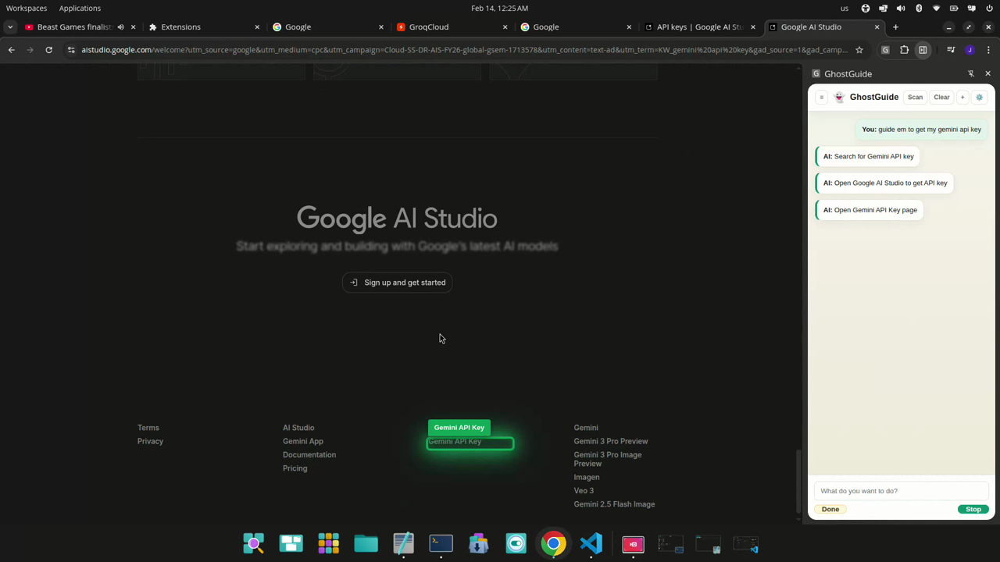

# GhostGuide

GhostGuide is a Chrome extension that turns a high‑level goal into step‑by‑step guidance on any website. It scans the live DOM (no screenshots), ranks likely targets, asks an AI for the next action, then highlights the exact element so you can complete the step confidently.

Demo video (full quality): `assets/demo.mp4`
Full video link: `https://github.com/kernel-ux/web_browser-navigation/raw/main/assets/demo.mp4`

## Why It’s Different

- DOM‑first guidance with precise element highlighting
- Semantic ranking with TensorFlow.js + Universal Sentence Encoder
- Multi‑step planning, loop detection, and recovery steps
- Works across navigation, search, forms, setup, and API key flows
- Runs fully as a Chrome MV3 extension with a side panel UI

## Quick Start

1. Open Chrome → `chrome://extensions`.
2. Enable **Developer mode**.
3. Click **Load unpacked** and select this repo folder.
4. Open the **GhostGuide** side panel.
5. Go to **Settings** and add your API key.
6. Enter a goal and click **Start**.

Full guide: `docs/USAGE.md`

## How To Use (Simple Guide)

1. Open any website you want help with.
2. Open the GhostGuide side panel.
3. In **Settings**, pick a provider and paste your API key.
4. In the input box, type a clear goal. Examples:
   - “Find the pricing page”
   - “Log in to my account”
   - “Search for noise‑canceling headphones”
   - “Get my API key”
5. Click **Start**.
6. Follow the highlighted step on the page.
7. Click **Done** to confirm each step.
8. If the AI says it’s finished, choose **Finished** or **Not finished** and continue.

Tips:
- If a page is blocked (new tab / chrome://), open a normal site and retry.
- If the AI gets stuck, click **Done** and give short feedback (e.g., “the button is labeled Continue”).
- For search tasks, GhostGuide may highlight the search box and ask you to press Enter.

## Copy & Use This Project

Option A: GitHub (recommended)
1. Create a new GitHub repo.
2. Copy this project into it.
3. Push your code.
4. Install the extension locally (Chrome → `chrome://extensions` → Load unpacked).
5. Add your API key in Settings and start using it.

Option B: Local only
1. Copy this folder anywhere on your machine.
2. Load it as an unpacked extension in Chrome.
3. Add your API key in Settings and start using it.

If you want to rename or rebrand:
- Update `manifest.json` name, version, and description.
- Update the title in `panel.html`.

## Contributing

See `CONTRIBUTING.md`.

## Providers

- Gemini (default)
- OpenAI
- Anthropic
- Groq
- DeepSeek
- OpenRouter
- Custom / Local

See setup notes in `docs/API_SETUP.txt`.

## How It Works

- `content.js` scans the DOM and highlights targets.
- `background.js` builds context and calls the selected AI provider.
- `panel.js` runs planning, ranking, verification, and UI.
- `sandbox.js` embeds text and ranks elements semantically.

## Project Structure

- `background.js` Chrome service worker and AI provider routing
- `content.js` DOM scan + visual actions
- `panel.html` Side panel UI markup
- `panel.css` UI styles
- `panel.js` Planner and runtime logic
- `sandbox.html` Sandboxed ranking environment
- `sandbox.js` Semantic ranking via USE
- `vendor/` Third‑party libraries
- `assets/` Demo media
- `docs/` Setup notes

## Notes

- The extension uses the Chrome Debugger API for optional fallback scans. You can disable this in Settings.
- The demo video is stored locally at `assets/demo.mp4` for GitHub previews.

## License

MIT. See `LICENSE`.
